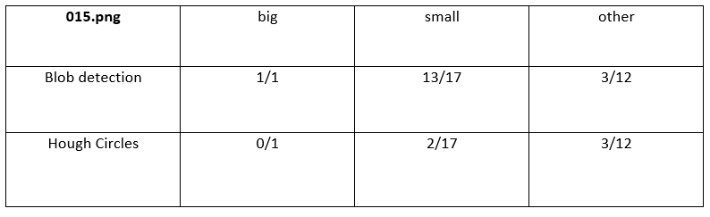
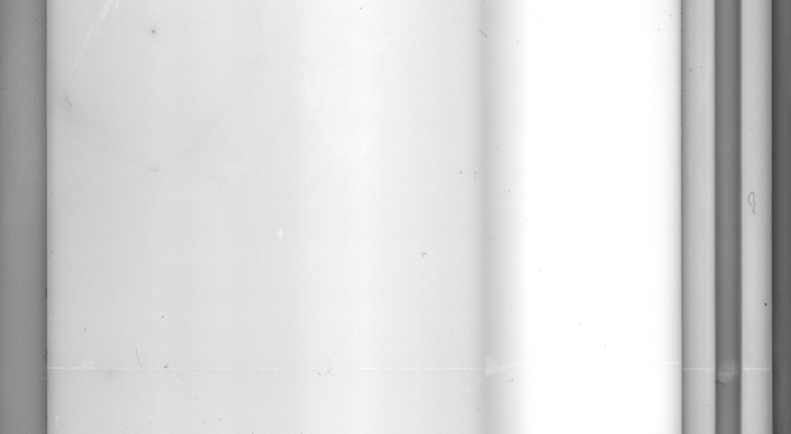

# Defect Detection

-----

- Requirements:
  - opencv
  - numpy
  - matplotlib
  - keras
  - tensorflow
  - pandas
  - pillow
  - skimage
  - seaborn
  - pathlib
  - sklearn
  
We implement two method to run:
  1. `blob detector.ipynb`
  2. `cnn-binary classes.ipynb`

First one, use Simple Blob Detector from cv2 to detect small and big blobs and dirt area in the image.

Second one, use convolutional neural networks for detecting small and big blobs and then use Simple Blob Detector from cv2 for detecting dirt area in the image.

## Blob Detector
### 1. Detect suspicious areas with blob detector algorithm, run FindKeypoints.py (015.png) :

-----

### 2. Set parameters of blob detection algorithm to classify blobs in 3 classes big (Red), small(Yellow), other(Black) :

-----
-----

### Comparision blob detector algorithm with Hough Circles in detect blobs (015.png) :

As we can see in above table, accuracy of Blob detector algorithm is more than Hough Circles algorithm. However, in small colum hough circles detects 2 small blobs, one of them is not detected in Blob Detection algorithm.

-----
-----
## Image Preprocessing:
Output of preoprocessing a part of image with normalizing image:

Test image (022.png):

